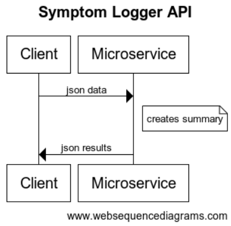
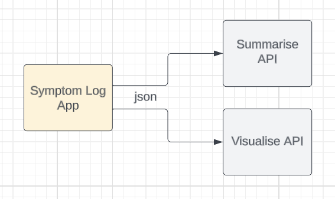

# Summarize API for Symptom Logger

A microservice to communicate with my client endpoint using json, to receive symptom data and return a summary of that data.

Creating a microservice for summarization allows me to update and improve it (like adding AI or using NLTK) without affecting the client app.

This API is part of a larger design for an application to allow users to input symptoms in a free-text format. After logging the symptoms, the application uses two separate APIs: one to summarize the entered data and another to create visual representations of that data.

